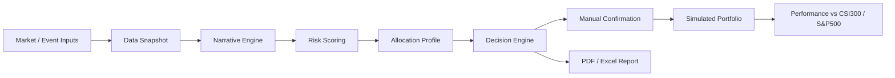

# SimVest 系统设计

## 1. 产品目标

面向个人和家庭账户，建立一个普通投资者可理解、可审计、可回测的模拟投资系统。系统每日追踪交易信息、指数变化、公司重大事件、宏观政策和国际地缘政治，推导市场主线，并输出非常具体的模拟投资决策。

系统的投资目标是：在自然年维度，扣除模拟交易费用和滑点后，长期与沪深300和标普500比较，并争取取得更好的风险调整后收益。

系统不承诺一定跑赢指数。

## 2. 用户约束

- 初始模拟资金：150,000 CNY
- 市场范围：中国大陆、香港为主
- 参考基准：沪深300、标普500
- 风险上限：最大回撤 20%
- 交易频率：每周 + 事件触发
- 真实交易：当前禁止
- 人工确认：必须
- 杠杆：禁止
- 做空：禁止
- 资产门槛：仅公开市场、低门槛产品

## 3. 资产范围

允许：

- A 股和港股大中盘股票
- 股票 ETF
- 债券和债券 ETF
- 公募基金和货币基金
- G10 外汇观察
- 黄金和原油相关产品
- 股指期货模拟对冲
- 远期合约模拟定价

禁止：

- ST 股票
- 亏损股
- 小盘股
- 中概股
- 可转债
- 做空
- 杠杆
- 裸露衍生品投机
- 非公开市场产品

## 4. 架构



## 5. 核心模块

- `simvest.config`：资金、基准、资产范围、风控参数
- `simvest.db`：SQLite 表结构和基础数据库工具
- `simvest.seed`：内置示例资产、事件、基准和市场快照
- `simvest.engine`：风险评分、档位选择、仓位生成、模拟确认
- `simvest.data_pipeline`：动态公开数据源同步、原始信息入库、市场快照重建
- `simvest.expert_debate`：公开数据、组合估值、事件因果链三位专家辩论，并生成中英双语商业报告
- `simvest.reports`：PDF 和 Excel 导出
- `simvest.server`：本地 HTTP API 和静态页面服务
- `simvest.sync_data`：命令行同步入口
- `static/*`：本地网页仪表盘

## 6. 数据模型

主要表：

- `assets`：资产池
- `benchmarks`：沪深300和标普500基准
- `events`：宏观、公司、政策、市场和地缘事件
- `market_snapshots`：每日市场快照
- `reports`：每日决策报告
- `decisions`：每条具体建议
- `positions`：模拟持仓
- `orders`：人工确认后的模拟订单
- `cash_ledger`：现金流水
- `portfolio_daily`：组合净值和指数对比
- `source_runs`：每次数据源同步的状态、记录数和错误
- `raw_documents`：新闻、公告、宏观数据等公共信息原文索引
- `market_data_history`：行情和指数历史抓取记录

## 7. 决策流程

1. 同步动态公开数据源。
2. 将行情写入资产池和行情历史。
3. 将 RSS、GDELT、World Bank 信息写入原始文档和事件流。
4. 重建最新市场快照。
5. 读取最新市场快照和事件流。
6. 计算风险分数，范围 0 到 100。
7. 自动选择档位：
   - `constructive`：偏进取
   - `balanced`：均衡
   - `elevated`：偏防守
   - `stressed`：防守
8. 根据档位生成目标仓位。
9. 将目标仓位与当前持仓比较。
10. 生成买入、卖出或持有建议。
11. 附带建议价、止损、止盈、持有期、触发条件、失效条件和置信度。
12. 等待人工确认。
13. 确认后才写入模拟订单和持仓。

## 7.1 动态数据源

配置文件：

```text
data/sources.json
```

当前适配器：

- `eastmoney_push2`：A 股、ETF、港股等公开行情快照
- `stooq_csv`：海外指数、外汇、商品等 CSV 快照
- `rss_feeds`：可配置 RSS/Atom
- `gdelt_queries`：全球新闻与地缘事件查询
- `world_bank_indicators`：World Bank 免费宏观指标

动态原则：

- 数据源可配置，不需要改代码即可增删关键词和标的。
- 每次报告生成前默认同步。
- 单个源失败只记录错误，不阻断其他源。
- 原始信息保留来源链接、时间、分类、情绪、严重度和置信度。
- 不绕过登录、不破解反爬、不高频请求。

## 8. 风控默认值

- 最大回撤：20%
- 回撤预警：12%
- 单一资产上限：25%
- 单只股票上限：10%
- 单行业上限：30%
- 单地区上限：70%
- 黄金上限：10%
- 原油上限：5%
- 最低现金：5%
- 债券最低评级：AA
- 衍生品：仅模拟对冲和定价，不进入普通人组合

## 9. 报告输出

每日报告包括：

- 中文主线
- 英文主线
- 中英文因果链
- 风险档位
- 组合动作
- 具体标的和仓位
- 买卖价格
- 止损止盈
- 触发条件
- 失效条件
- 持有周期
- 置信度
- PDF 导出
- Excel 导出

## 10. 下一阶段路线

### 数据接入

- 免费日线行情
- 指数历史数据
- 交易所公告
- 财报和估值数据
- 宏观数据
- 新闻和地缘政治 RSS

### 策略验证

- 2020 年以来回测
- 滚动样本外验证
- 交易费和滑点
- 月度、季度、年度归因
- 策略失效检测

### 安全升级

- 用户登录
- 审计日志
- 策略版本号
- 数据快照版本号
- 实盘接口只读模式
- 真实下单二次确认
